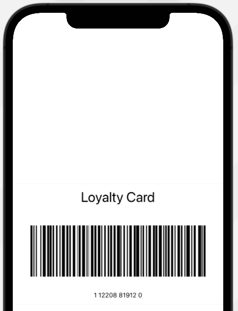

# SwiftletBarcodes for Swift and SwiftUI

      

Creates a Barcode as a `Image` representing the given data (as a `String`)  in the given `BarcodeFormat`. **SwiftletBarcodes** can generate barcodes in the following formats:

* Code 128
* PDF 417
* Aztec
* QR Code
 
There are two forms of the `generate` function:
 
* One generates the requested barcode at the system specified size.
* The other generates the barcode at a given `width` and `height`.
 
<a name="Installation"></a>
## Installation

**Swift Package Manager** (Xcode 11 and above)

1. Select **File** > **Swift Packages** > **Add Package Dependency…** from the **File** menu.
2. Paste `https://github.com/Appracatappra/SwiftletBarcodes.git` in the dialog box.
3. Follow the Xcode's instruction to complete the installation.

> Why not CocoaPods, or Carthage, or blank?

Supporting multiple dependency managers makes maintaining a library exponentially more complicated and time consuming.

Since, the **Swift Package Manager** is integrated with Xcode 11 (and greater), it's the easiest choice to support going further.

## Using SwiftletBarcodes

**SwiftletBarcodes** in very easy to use in you SwiftUI app. The following example shows how to generate barcodes with either of the two `generate` functions.

### Example:
```swift
// At system size
let barcodeA = SwiftletBarcodes.generate(from:"142208819120", format:.code128)
 
// At a given width and height
let barcodeB = SwiftletBarcodes.generate(from:"142208819120", format:.code128, width:250, height:100)
```

Additionally, **SwiftletBarcodes** include a pre-made SwiftUI View to display a barcode card, `SwiftletBarcodeView`.

### Example
The following is an example of displaying the `SwiftletBarcodeView` on an iOS device:

```swift
SwiftletBarcodeView(showTitle: true, title:"Loyalty Card", showData: true, data: "1 12208 81912 0", format: .code128, hasDivider: true, width: 380, height: 150)
```

Will result in a screen like the following being displayed:

